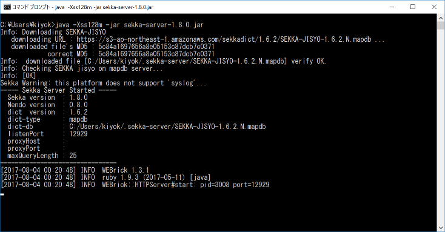

# Sekka (石火) SKK like Japanese input method

  [](https://travis-ci.org/kiyoka/sekka)

----

## 基本操作

Sekkaには日本語モードがありません。
ローマ字表記ルールはSKKに似ています。

   Emacsの編集中バッファで _Kanji_ `[Ctrl-j]` とタイプすると **漢字** に変換されます。
   
   Emacsの編集中バッファで _kanji_ `[Ctrl-j]` とタイプすると **かんじ** に変換されます。
   
   Emacsの編集中バッファで _kanJi_ `[Ctrl-j]` とタイプすると **感じ** に変換されます。

詳細は <http://oldtype.sumibi.org/show-page/Sekka.Emacs> を参照してください。

----

## 変換サーバーのインストール

1. sekka-server-1.8.0.jar をダウンロードしてください． <https://github.com/kiyoka/sekka/releases/tag/v1.8.0>
2. 次のコマンドでサーバーを起動してください．localhostのポート番号12929でクライアントからのHTTP通信待ち状態になります。

```
java -Xss128m -jar sekka-server-1.8.0.jar
```



----

## Emacsクライアントのインストール

1. Melpaから`sekka`パッケージをインストールしてください。
2. .emacsに以下を追記すると、Sekkaが有効になります。

```
(require 'sekka)
(global-sekka-mode 1)
```


----

## より詳細なドキュメント
[Sekka](doc/Sekka.md)
