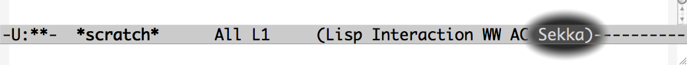

# Sekka (石火) SKK like Japanese input method
 

## Sekka(石火)はSKKライクな日本語入力メソッドです。
 <http://oldtype.sumibi.org/show-page/Sekka>

----

## 変換方法

Sekkaには日本語モードがありません。
ローマ字表記ルールはSKKに似ています。

 Emacsの編集中バッファで Kanji `[Ctrl-j]` とタイプすると `漢字` に変換されます。 

 Emacsの編集中バッファで `kanji`[Ctrl-j] とタイプすると `かんじ` に変換されます。 

 Emacsの編集中バッファで `kanJi`[Ctrl-j] とタイプすると `感じ` に変換されます。 

詳細は <http://oldtype.sumibi.org/show-page/Sekka.Emacs> を参照してください。

----

## EmacsLispのインストール

Melpaから`sekka`パッケージをインストールしてください。

.emacsに以下を追記すると、Sekkaが有効になります。

    (require 'sekka)
    (global-sekka-mode 1)

## 変換サーバーのインストール

dockerでsekkaイメージをインストール・実行してください。
ポート12929でクライアントからの通信(http)待ち状態になります。

    sudo docker run -p 12929:12929 -t kiyoka/sekka

