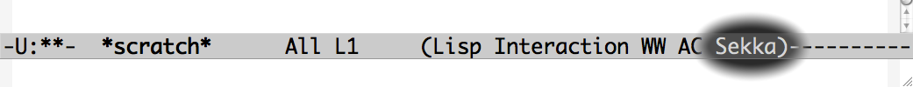

# Sekka (石火) SKK like Japanese input method

  [](https://travis-ci.org/kiyoka/sekka)

----

## 基本操作

Sekkaには日本語モードがありません。
ローマ字表記ルールはSKKに似ています。

   Emacsの編集中バッファで _Kanji_ `[Ctrl-j]` とタイプすると **漢字** に変換されます。
   
   Emacsの編集中バッファで _kanji_ `[Ctrl-j]` とタイプすると **かんじ** に変換されます。
   
   Emacsの編集中バッファで _kanJi_ `[Ctrl-j]` とタイプすると **感じ** に変換されます。

詳細は <http://oldtype.sumibi.org/show-page/Sekka.Emacs> を参照してください。

----

## インストール

Sekka は [MELPA](https://melpa.org/) から `M-x package-install` でインストールできます。

### 1. MELPA を `package-archives` に追加

`~/.emacs.d/init.el` (または `~/.emacs`) に以下を追記してください。MELPA を既に追加済みなら不要です。

```elisp
(require 'package)
(add-to-list 'package-archives
             '("melpa" . "https://melpa.org/packages/") t)
(package-initialize)
```

### 2. パッケージをインストール

```
M-x package-refresh-contents RET
M-x package-install RET sekka RET
```

### 3. Sekka を有効化

`init.el` に以下を追記します。

```elisp
(require 'sekka)
(global-sekka-mode 1)
```

`use-package` を使う場合の例:

```elisp
(use-package sekka
  :ensure t
  :config
  (global-sekka-mode 1))
```



### 辞書ファイルについて

初回起動時に、変換用の辞書ファイルが `~/.emacs.d/sekka/` (デフォルト) へ
GitHub から自動的にダウンロードされます。2 回目以降はキャッシュを利用するため、
オフラインでも動作します。

ダウンロード元やキャッシュ先は以下の変数でカスタマイズできます。

| 変数 | デフォルト | 役割 |
|---|---|---|
| `sekka-dictionary-base-url` | `https://raw.githubusercontent.com/kiyoka/sekka/master/data/` | 辞書ダウンロード元 URL |
| `sekka-dictionary-cache-dir` | `~/.emacs.d/sekka/` | キャッシュ先ディレクトリ |

事前に辞書をダウンロードしておきたい場合は、以下を実行してください。

```
M-x sekka-jisyo-download-dictionaries
```

----

## より詳細なドキュメント
[Sekka](doc/Sekka.md)
