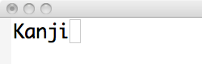
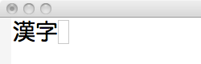

# EmacsからのSekka(石火)の使いかた
 

## はじめに
[Sekka](https://github.com/kiyoka/sekka)に興味を持ったあなたは、SKKユーザーである可能性が高いでしょう。
そこで、SKKとの相違点、共通点について説明します。

### SKKとの相違点
ひとつめの違いは英数、ひらがな、カタカナ、漢字変換モードのようなモード切りかえが無いことです。
カーソル位置のローマ字を[Ctrl-J]キーで直接、ひらがな、カタカナ、漢字、全角アルファベットに変換できます。
これは[Sekka](https://github.com/kiyoka/sekka)がインストールされた状態であればどのバッファの中でも有効です。(ミニバッファでも変換できます)

もうひとつの違いは、ミスタイプを許容してくれるところです。
辞書に入っている単語であれば、曖昧なローマ字で絞りこんで変換してくれます。

### SKKとの共通点
ローマ字の綴りかたはSKKと似ています。
漢字に変換する時に、ローマ字の1文字目を大文字で開始する点や、送り仮名の開始位置を大文字にする点などは同一です。


## 準備
Emacsのモードラインに「Sekka」という文字が表示されているか確認してください。
以下のようなイメージです。

もし、表示されていないようでしたら、[Sekka.Setup](Sekka.Setup.md)(セットアップ手順)を確認してください。


# 基本操作

## ローマ字＋[Ctrl-J]
[Ctrl-J]は一番使うキーですので、最初に覚えてください。
Emacsのどのバッファ内でも、カーソルの直前のローマ字を [Ctrl-J] キーで変換できます。


   ↓[Ctrl-J]を押す。

このように、[Ctrl-J]で第一候補で確定します。(ローマ字が第一候補の文字列に置換されます)
Microsoft IMEのように、長文を一気に変換することはできません。1文節づつ変換します。

## 変換候補の切りかえ
確定済みの候補が気に入らない場合は別の候補に切りかえることができます。
最後に確定した単語の最後にカーソルを合わせて、[Ctrl-J]を押すと、候補選択モードに入ります。

さらに、[Ctrl-J]を押していくと、変化候補が次々と変ります。
候補選択モード内のその他のキーについては、後述のキーマップ一覧を見てください。


# ローマ字綴りルール
SKKユーザーには馴染みのあるルールです。

## ローマ字 => ひらがな変換
全て小文字でローマ字を表記します
hiragana[Ctrl-J]
↓
ひらがな

## ローマ字 => カタカナ変換 (辞書にそのカタカナ語が入っている場合)
先頭1文字だけ大文字でローマ字を表記します。
Painappuru[Ctrl-J]
↓
パイナップル

## ローマ字 => カタカナ変換 (辞書に入っていない場合)
全て小文字でローマ字を表記し、[Ctrl-J]を何度も押します。
surasura[Ctrl-J][Ctrl-J][Ctrl-J]
↓
スラスラ

## 漢字(送り仮名なし)
先頭1文字だけ大文字でローマ字を表記します。
Toukyouto[Ctrl-J]
↓
東京都

## 漢字(送り仮名あり)
送り仮名が開始する子音だけを大文字にします。
toRu[Ctrl-J]
↓
取る

先頭を大文字にしても同様に変換できます。
ToRu[Ctrl-J]
↓
取る

## 数字+単位
単位を伴う数字を入力するばあいは、数字と単位をつなげて表記します。
変換候補には、全角/半角のアルファベットや漢数字が含まれています。
20ko[Ctrl-J]
↓
二十個[Ctrl-J]
↓
２０個[Ctrl-J]
↓
20個


10gatu10ka[Ctrl-J]
↓
１０月１０日

## 数字
数字だけで変換すると、全角/半角のアルファベットや漢数字に変換できます。
1000[Ctrl-J]
↓
１０００[Ctrl-J][Ctrl-J][Ctrl-J]
↓
千

## アルファベットとの混在入力
アルファベットの直後に漢字を入力したい場合、どこが区切りか指定する必要があります。
例えば、「methodを」と入力したい場合、区切る方法として2種類あります。

### "/" を使う
method/wo[Ctrl-J]
↓
methodを
変換が成功すれば、"/" 文字は取り去られます。

### set-markを使う
method[Ctrl-Space]wo[Ctrl-J]
↓
methodを
要するに、変換対象をリージョン指定するわけです。


# 変換候補のリアルタイム表示
一度[Ctrl-J]を押すと、変換候補のリアルタイム表示が開始します。

  ↓heを入力

  ↓nを入力

  ↓kanを入力

このリアルタイム表示は、システムが「ユーザーはこれ以上日本語変換をしないだろう」と判断すると自動的に止まります。
次のいずれかに該当したら停止します。
- 最後に[Ctrl-J]を押してから30秒経過すると止まります。
- 最後に[Ctrl-J]を押した行から上下に5行以上カーソル移動すると止まります。
上記はデフォルト値であり、M-x customize-groupで変更可能です。


# sticky-shift
[Sekka](https://github.com/kiyoka/sekka)はsticky-shift機能を内蔵しています。
有効にする場合は、.emacs に以下の行を追加してください。
```lisp
(setq sekka-sticky-shift t)
```
※ この変数はカスタマイズ変数ではありません。

C言語、C++言語のコメントに日本語を入力されるかたは、c-modeに ";" を上書きされないように、以下を設定しておくと良いでしょう。
```lisp
(add-hook 'c-mode-hook 'my-c-mode-setup)
(defun my-c-mode-setup ()
  (define-key c-mode-base-map ";"         nil))
```


# キーマップ一覧
## 初期状態
[Ctrl-J]     ローマ字をsekka-serverに送信して第一候補で確定する。
[SPACE]      ローマ字をsekka-serverに送信して第一候補で確定する。(但し、リアルタイム表示中のみ)
[Esc-J]      ローマ字の先頭1文字の大文字・小文字をトグルする。
`;`            sticky-shiftのShift状態に移行する。
[Ctrl-G]     リアルタイム表示をストップする

※ [SPACE]の動作は、カスタマイズ変数 sekka-kakutei-with-spacekey を t に設定しないと有効になりません。


## 直前に確定した単語にカーソルがある状態
[Ctrl-J]     候補選択モードに入る
[SPACE]      候補選択モードに入る


## 候補選択モード
[前]
[Ctrl-P]     次の候補に進める

[次]
[Ctrl-J]     次の候補に進める
[Ctrl-N]     次の候補に進める
[SPACE]      次の候補に進める

[キャンセル]
[Ctrl-G]     候補の切り替えを破棄して候補選択モードを終了する
`q`            候補の切り替えを破棄して候補選択モードを終了する

[確定]
[Ctrl-M]     現在表示されている候補で確定し、候補選択モードを終了する

[頭出し]
[Ctrl-A]     漢字の第一候補に直接切りかえる

[ひらがな化]
[Ctrl-U]     ひらがな候補に直接切りかえる (MS IMEから連想)

[カタカナ化]
[Ctrl-I]     カタカナ候補に直接切りかえる (MS IMEから連想)
[Ctrl-K]     カタカナ候補に直接切りかえる (ことえりから連想)

[半角英数化]
[Ctrl-L]     半角英数候補に直接切りかえる (SKKから連想)

[全角英数化]
[Ctrl-E]     全角英数候補に直接切りかえる


[確定して次の文字入力開始]
その他       現在表示されている候補で確定・終了し、継続して文字入力を行えます。

[ユーザー定義語彙の登録]
[Ctrl-R]     ひらがな候補に対応するユーザー定義語彙を追加開始する。


# カスタマイズ
```
M-x customize-group [return]
```
でプロンプトが出たら、sekkaと入力すると、sekkaのカスタマイズ画面に入ります。
項目については、実際にカスタマイズ画面に入って説明を読んで下さい。


# ユーザー登録語彙について

## 登録操作について
sekka.elではユーザー定義語彙を自分で入力する手間を省くために、GoogleImeAPIで取得した変換候補から選択するだけで良いようになっています。
もし、その候補に期待したものが無ければ、初めて自分で入力することになります。
期待したものが無ければメニューから「(自分で入力する)」を選んで対話的に入力するか、後述の ~/.sekka-jisyoを直接編集する方法のどちらかになります。


## ~/.sekka-jisyoを直接編集する場合
~/.sekka-jisyo というファイルにユーザー語彙を記述してください。
このファイルの内容がEmacsからの初回変換時にsekka-serverにそのまま送信されます。
「M-x sekka-register-userdict 」で いますぐ ~/.sekka-jisyo をサーバーに送信することもできます。

.sekka-jisyoのフォーマットは、SKKと互換です。つまり SKK-JISYO.L や ~/.skk-jisyo と互換性があります。(但し、utf-8でないといけません)
DDSKKから移行される際は、.skk-jisyo をコピーしてください。
```bash
cd
cp .skk-jisyo .sekka-jisyo
``` 
最後に、.sekka-jisyoをutf-8で保存しなおして下さい。 (M-x set-bufer-file-coding-systemを使うなど)

[~/.sekka-jisyo] 例:
```
へんしゅうきょり /編集距離/
あいまいけんさく /曖昧検索/
あいまいもじれつまっちんぐ /曖昧文字列マッチング/
たけうちかんすう /竹内関数/
ばぐしゅうせい /バグ修正/
てすとすいーと /テストスイート/
```


## ユーザー語彙選定のコツ
未知語を登録するだけでなく、よく使う複合語(長い単語)を登録しておくと、曖昧検索機能の恩恵を受けることができます。
例えば、以下の例のように途中しか入力しなくても長い語彙が出てきてくれたり、ミスタイプを救済してくれることが多くなり便利です。

Aimaimojiretu[Ctrl-J]
  ↓第一候補が絞りこまれる
曖昧文字列マッチング

Aimaimijoretumacching
  ↓かなりミスタイプがあっても許容してくれる
曖昧文字列マッチング

Tesutosui
  ↓第一候補が絞りこまれる
テストスイート


平仮名フレーズでよく使うフレーズをあらかじめ登録しておくとミスタイプを救済してくれるます。
平仮名フレーズエントリは、変換対応を「//」で指定します。
```
なっています //
```

nateimasu
  ↓本来「なています」というミスになるが、知っている正しい平仮名フレーズを優先して候補に出してくれる。
なっています


## ~/.sekka-jisyoをDropboxで共有する
Dropboxを使えば、ユーザ辞書を複数のEmacsで共有できます。
※ Dropboxのアカウントは以下のサイトで取得してください。
 [Dropbox - 安全なバックアップ、同期、および共有を簡単に。](http://www.dropbox.com/)

.sekka-jisyoファイルをDropboxのディレクトリに移動し、カスタマイズ変数 sekka-jisyo-filename 以下のようにを設定します。
 


# 複数のsekka-serverの自動切替
Sekka 0.9.3からsekka.elに３つののsekka-serverを登録できるようになりました。
以下の図の様に、サーバがダウンしている時はsekka.elが別のサーバに自動切替します。

以下の３つのカスタマイズ変数にURLを設定すると準備完了です。接続優先順に記載しています。
- sekka-server-url
- sekka-server-url-2
- sekka-server-url-3


[以上]
